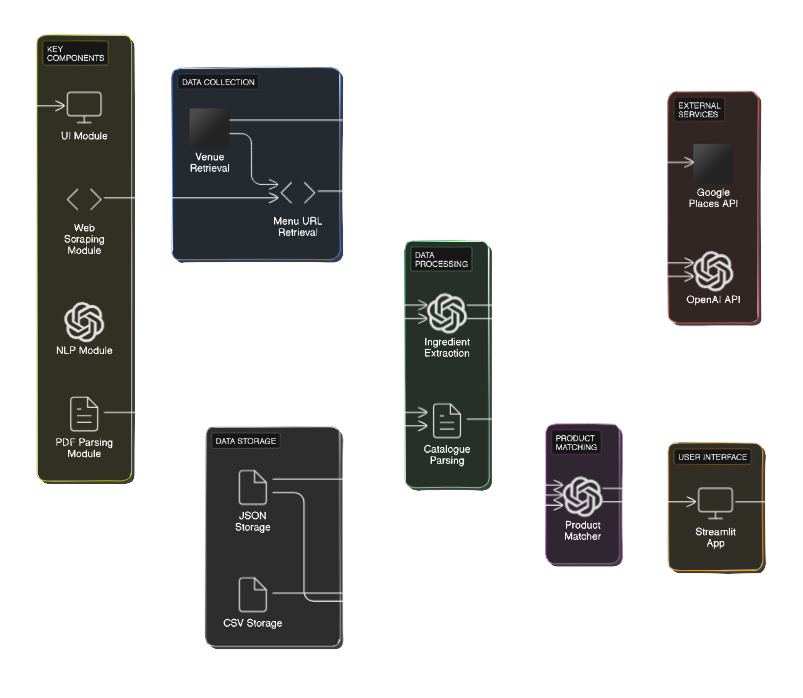

# Smart Product Suggestions for Food Distributors

This project aims to help sales representatives at food distribution companies improve their sales by providing targeted product suggestions for venues in Sydney CBD.

## Table of Contents

1. [Project Setup](#project-setup)
2. [Installation](#installation)
3. [Usage](#usage)
4. [Project Structure](#project-structure)
5. [Testing](#testing)
6. [Architecture](#architecture)
7. [Thought Process and Trade-offs](#thought-process-and-trade-offs)
8. [Future Improvements](#future-improvements)

## Project Setup

1. **Clone the repository locally:**

   ```bash
   git clone https://github.com/mriyaz/smart-product-suggestions.git
   cd smart-product-suggestions
   ```

2. **Set up a Python virtual environment:**

   ```bash
   python -m venv venv
   source venv/bin/activate  # On Windows, use: venv\Scripts\activate
   ```

## Installation

1. **Install the required dependencies:**

   ```bash
   pip install -r requirements.txt
   ```

2. **Set up your API keys in the `.env` file:**

   Create a `.env` file with the following content:

   ```ini
   google_api_key = = YOUR_GOOGLE_PLACES_API_KEY

   openai_api_key = YOUR_OPENAI_API_KEY
   ```

## Usage

1. **Run the scripts in the following order:**

   ```bash
   python src/venue_retrieval.py
   python src/menu_url_retrieval.py
   python src/ingredient_retrieval.py
   python src/catalogue_parsing.py
   python src/product_matching.py
   ```

2. **Start the Streamlit app:**

   ```bash
   streamlit run src/sales_suggestions.py
   ```

## Project Structure

```
smart-product-suggestions/
│
├── data/
│   ├── PremierQualityFoodsBrochure2021.pdf
│   ├── venues.json
│   ├── venues_with_menu_urls.json
│   ├── ingredients.json
│   ├── catalogue.csv
│   └── product_matches.json
│
├── src/
│   ├── venue_retrieval.py
│   ├── menu_url_retrieval.py
│   ├── ingredient_retrieval.py
│   ├── catalogue_parsing.py
│   ├── product_matching.py
│   ├── sales_suggestions.py
│   └── utils.py
│
├── tests/
│   ├── test_venue_retrieval.py
│   ├── test_menu_url_retrieval.py
│   ├── test_ingredient_retrieval.py
│   ├── test_catalogue_parsing.py
│   ├── test_product_matching.py
│   └── test_sales_suggestions.py
│
├── .gitignore
├── config.ini
├── requirements.txt
└── README.md
```

## Testing

Run the tests in the test directory using pytest.
```bash
   pytest ./tests/test_venue_retrieval.py
   pytest ./tests/test_menu_url_retrieval.py
   pytest ./tests/test_ingredient_retrieval.py
   pytest ./tests/test_catalogue_parsing.py
   pytest ./tests/test_product_matching.py
   pytest ./tests/test_sales_suggestions.py
```

## Architecture



A step-by-step architecture description for the smart product suggestion system:

1. **Data Collection:** 
   - Venue Retrieval: Uses Google Places API to fetch restaurant, bar, and cafe data in Sydney CBD.
   - Menu URL Retrieval: Employs web scraping to extract menu URLs from venue websites.

2. **Data Processing:**
   - Ingredient Extraction: Scrapes menu content from URLs and uses ChatGPT to extract ingredients.
   - Catalogue Parsing: Extracts product names from the FOBOH product catalogue PDF.

3. **Product Matching:**
   Matches venue ingredients to catalogue products using ChatGPT for semantic understanding.

4. **User Interface:**
   Streamlit web application for displaying matched products and generating sales pitches.

5. **Data Flow:**
   Venue data → Menu URLs → Ingredients → Matched Products → Sales Suggestions

6. **External Services:**
   - Google Places API for venue data
   - OpenAI API (ChatGPT) for natural language processing tasks

7. **Data Storage:**
   - JSON files for storing intermediate and final data
   - CSV file for storing the parsed product catalogue

8. **Key Components:**
   - Web scraping module (requests,BeautifulSoup,Selenium)
   - PDF parsing module (PyPDF2)
   - Natural language processing module (ChatGPT)
   - User interface module (Streamlit)

## Thought Process and Trade-offs

1. **API Usage:**
   We rely heavily on external APIs (Google Places, OpenAI) for several reasons:
   - Google Places API provides accurate, up-to-date information about venues in Sydney CBD.
   - OpenAI's ChatGPT offers powerful natural language processing capabilities for tasks like ingredient extraction and product matching.

   Trade-offs:
   - Pros:
     - Access to high-quality, real-time data
     - Leveraging sophisticated AI models without building them in-house
     - Rapid development and deployment
   - Cons:
     - Potential costs associated with API usage, especially at scale
     - Dependency on external services, which may have downtime or changes in their APIs
     - Rate limiting can slow down data retrieval and processing
     - Privacy concerns when sending data to external services

2. **Web Scraping:**
   We use a combination of `requests`, `BeautifulSoup`, and `Selenium` for web scraping:
   - `requests` and `BeautifulSoup` are used for simple, static websites
   - `Selenium` is employed for more complex, JavaScript-rendered sites

   Trade-offs:
   - Pros:
     - Ability to handle a wide range of website structures and technologies
     - Can navigate and interact with dynamic web pages
   - Cons:
     - Selenium is significantly slower than simple requests
     - More complex to set up and maintain, especially across different environments
     - May break if websites change their structure or implement anti-scraping measures
     - Ethical and legal considerations around web scraping

3. **Data Processing:**
   We use ChatGPT for various data processing tasks, including ingredient extraction and product matching:

   Trade-offs:
   - Pros:
     - Flexibility to handle diverse and unstructured data
     - Can understand context and nuances in natural language
     - Adaptable to new types of inputs without rewriting rules
   - Cons:
     - Results may be inconsistent or unpredictable
     - Lack of fine-grained control over the processing logic
     - Potential for hallucinations or incorrect information
     - Computationally expensive compared to rule-based systems

4. **Storage:**
   We use JSON and CSV files for data storage:

   Trade-offs:
   - Pros:
     - Simple to implement and use
     - Human-readable formats
     - Easy to version control
     - No need for a separate database system
   - Cons:
     - Not efficient for large datasets or frequent updates
     - Lack of advanced querying capabilities
     - No built-in support for concurrent access or transactions
     - Limited data validation and integrity checks

5. **User Interface:**
   We chose Streamlit for the user interface:

   Trade-offs:
   - Pros:
     - Rapid development and prototyping
     - Easy to create interactive data applications
     - Good integration with Python data science libraries
   - Cons:
     - Limited customization options compared to full-fledged web frameworks
     - May not be suitable for complex, multi-page applications
     - Performance can be an issue for large-scale applications
     - Less control over the underlying web technologies

## Future Improvements

1. **Implement a database backend:**
   - Use a relational database (e.g., PostgreSQL) or a NoSQL database (e.g., MongoDB) depending on the data structure and query patterns.
   - Benefits:
     - Improved data organization and retrieval efficiency
     - Better support for concurrent access and data integrity
     - Advanced querying capabilities
     - Scalability for larger datasets
   - Considerations:
     - Increased complexity in setup and maintenance
     - Need for database administration skills
     - Potential costs for hosted database solutions

2. **Add user authentication and role-based access control:**
   - Implement a user management system with features like registration, login, and password reset.
   - Define roles (e.g., sales rep, manager) with different access levels to features and data.
   - Benefits:
     - Enhanced security and data privacy
     - Personalized experiences for different user types
     - Ability to track individual user actions and preferences
   - Considerations:
     - Increased development time and complexity
     - Need for secure storage of user credentials
     - Compliance with data protection regulations (e.g., GDPR)

3. **Implement caching:**
   - Use caching mechanisms (e.g., Redis) to store frequently accessed data or API responses.
   - Implement intelligent caching strategies based on data freshness requirements.
   - Benefits:
     - Reduced API calls, leading to lower costs and faster response times
     - Improved application performance
     - Reduced load on external services
   - Considerations:
     - Complexity in managing cache invalidation
     - Potential for serving stale data if not managed properly
     - Additional infrastructure requirements

4. **Develop a more sophisticated product matching algorithm:**
   - Explore machine learning techniques such as:
     - Text classification for categorizing menu items
     - Word embeddings for semantic similarity between ingredients and products
     - Recommendation systems for suggesting related products
   - Benefits:
     - Improved accuracy and relevance of product matches
     - Ability to handle more complex relationships between ingredients and products
     - Potential for personalized recommendations based on historical data
   - Considerations:
     - Requires significant data collection and preparation
     - Need for ongoing model training and maintenance
     - Increased computational requirements

5. **Enhance error handling and implement comprehensive logging:**
   - Implement robust error handling throughout the application, with appropriate user feedback.
   - Set up a centralized logging system (e.g., ELK stack - Elasticsearch, Logstash, Kibana) for monitoring and debugging.
   - Benefits:
     - Improved application reliability and user experience
     - Easier troubleshooting and bug fixing
     - Better insights into application usage and performance
   - Considerations:
     - Increased development time for implementing proper error handling
     - Need for additional infrastructure for log management
     - Potential privacy concerns with extensive logging

